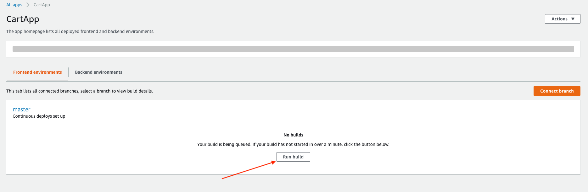

# Serverless Shopping Cart Microservice

## Automatically deploy backend and frontend using Amplify Console


[Create a new personal access token](https://help.github.com/en/articles/creating-a-personal-access-token-for-the-command-line) 
on GitHub. 
Amplify will need this to access your repository. The token will need the “repo” OAuth scope.

### Deploying Application


#### Linux / MacOS

1. Set environment variables:

    ```bash
    export GITHUB_REPO=https://github.com/bhavya-cloudaeye/aws-serverless-shopping-cart
    export GITHUB_BRANCH=master  # Or whichever branch you wish to track
    export GITHUB_OAUTH_TOKEN=<github personal access token>
    ```
2. Create the Amplify console application, which will provide basic continuous deployment for your Github repository: 
    ``` bash
    make amplify-deploy  # Creates amplify console application
    ```

#### Windows

1. Set environment variables:

    ```bash
    $Env:GITHUB_REPO="https://github.com/bhavya-cloudaeye/aws-serverless-shopping-cart"
    $Env:GITHUB_BRANCH="master"
    $Env:GITHUB_OAUTH_TOKEN=<github personal access token>
    ```
2. Make instructions has linux command, so make might not work on windows as expected. So use the below commands to install the app: 
    ``` bash
    $Env:s3_BUCKET="aws-serverless-shopping-cart-src-739457818465-us-east-2"

    aws cloudformation deploy --template-file ./amplify-ci/amplify-template.yaml --capabilities CAPABILITY_IAM --parameter-overrides OauthToken=$Env:GITHUB_OAUTH_TOKEN Repository=$Env:GITHUB_REPO BranchName=$Env:GITHUB_BRANCH SrcS3Bucket=$Env:S3_BUCKET --stack-name CartApp
    ```
    > Make command internally also uses the same cloudformation command to deploy the app

This step creates an amplify app called `CartApp`.

### Running the first build

- Go to the [AWS Amplify console](https://console.aws.amazon.com/amplify/home), then click on `CartApp` and **Run Build**. 
This will deploy both the frontend and backend applications


> After the build succeeds you should see three new cloudformation stacks


### Setting Up

### Collecting the app endpoint
- Goto `amplify` in the aws console.
- Select `CartApp` and copy the URL of the shopping cart and open it in a browser.
- Click `sign up` and create an account 
  > NOTE : This step involves **Code verification** so provide a valid email

### Collecting the database endpoints
- Goto `dynamodb` in the aws console
- Goto `tables` in the left menu to find the table whose name starts with **lambda-sample-shoopingcart**
- Create a **backup** of this (to help restore after fault injection)
    - Goto `Backups` in the left menu
    - Select create backup (on demand)
    - Select the above table and give the backup a proper name

### Manual update of Alias
- At the moment all the lambda functions generated by this application have the `live` alias pointing to a particular version of function (the most recent version available during the build).
- This mapping needs to be updated everytime there is any change made to the lambda function code or configuration and a new version is released.
- To avoid this re-work everytime we make changes to the lambda while testing, point all your app's lambda functions to use `Alias: live -> $LATEST`

### Clean Up
- Delete the CloudFormation stacks created by this project. One is named "CartApp", and then there are 3 with names 
starting with **aws-serverless-shopping-cart-**.
- Delete the backup (if created) for the dynamodb